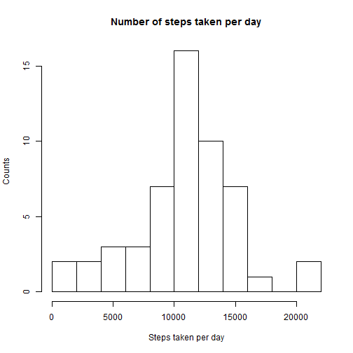
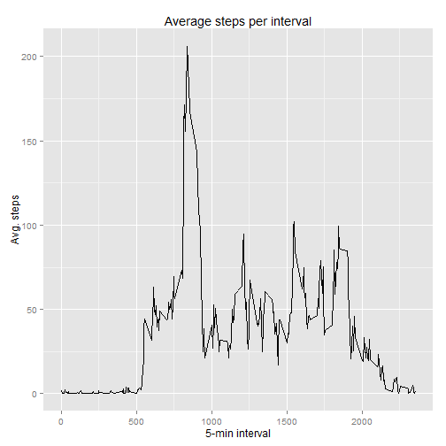
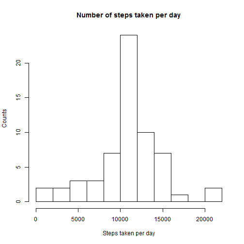

### Set global settings

```r
library(knitr)
opts_chunk$set(echo=T, results="hide")
```


### Loading and preprocessing the data

```r
rm(list=ls())
data_df <- read.csv("activity.csv")
```


### What is mean total number of steps taken per day?

```r
StepsPerDay <- aggregate(steps~date, data=data_df, sum)
hist(StepsPerDay$steps, main="Number of steps taken per day",
     xlab="Steps taken per day", ylab="Counts", breaks=12)
```

 

```r
MeanStepsPerDay <- mean(StepsPerDay$steps)
MedianStepsPerDay <- median(StepsPerDay$steps)
```

The mean and median steps per day are 10766.19 and 10765 respectively. 

### What is the average daily activity pattern?

```r
StepsPerInterval <- aggregate(steps~interval, data=data_df, mean)
library(ggplot2)
p <- ggplot(StepsPerInterval, aes(interval, steps))
p + geom_line() + labs(title="Average steps per interval",
                       x="5-min interval",y="Avg. steps")
```

 

```r
MaxStepInterval <- StepsPerInterval[which.max(StepsPerInterval$steps),1]
```

The interval corresponding to the maximum number of steps is 835. 


### Imputing missing values

```r
NumberOfNAs <- sum(is.na(data_df[,1]))

data_df2 <- data_df

UniqueIntervals <- unique(data_df["interval"])

for (i in UniqueIntervals[,1]) 
{
    IntervalAvgStep <- StepsPerInterval[which(StepsPerInterval$interval==i), 2]
    data_df2[which(data_df2$interval==i & is.na(data_df2$steps)), 1] <- IntervalAvgStep
}
StepsPerDay2 <- aggregate(steps~date, data=data_df2, sum)
hist(StepsPerDay2$steps, main="Number of steps taken per day",
     xlab="Steps taken per day", ylab="Counts", breaks=12)
```

 

```r
MeanStepsPerDay2 <- mean(StepsPerDay2$steps)
MedianStepsPerDay2 <- median(StepsPerDay2$steps)
```

The mean and median number of steps per day taking into account the NAs are 10766.19 and 10766.19 respectively. Based on these results, the mean number of steps is not affected due to the NAs, while the median value is slightly affected, albeit negligible. It seems that by taking into account the NAs, the distribution becomes slightly more symmetrical, i.e. the mean and the median are very close to each other. 

# Are there differences in activity patterns between weekdays and weekends?

```r
data_df3 <- data_df2

data_df3$weekdays <- as.factor(weekdays(as.Date(as.character(data_df3[,2]))))
'%ni%' <- Negate('%in%')
tmp <- sample(0:1, nrow(data_df3), replace=T)
tmp <- factor(tmp, labels=c("Weekday", "Weekend"))
tmp[which(data_df3$weekdays %in% c("Saturday", "Sunday"))] <- as.factor("Weekend")
tmp[which(data_df3$weekdays %ni% c("Saturday", "Sunday"))] <- as.factor("Weekday")
data_df3$weekdays <- tmp

# As a sanity check, we can issue the following commands
weekend_tmp <- unique(data_df3[which(data_df3$weekdays == "Weekend"),2])
print(weekend_tmp)
print(weekdays(as.Date(weekend_tmp))[1:12])

StepsPerIntervalWeekdays <- aggregate(steps~interval+weekdays, 
                                      data=subset(data_df3, weekdays=="Weekday"), mean)
StepsPerIntervalWeekends <- aggregate(steps~interval+weekdays, 
                                      data=subset(data_df3, weekdays=="Weekend"), mean)
StepsPerIntervalweekdays <- rbind(StepsPerIntervalWeekdays,StepsPerIntervalWeekends)


library(lattice)
xyplot(steps~interval | weekdays, data=StepsPerIntervalweekdays, layout=c(1,2), type="l")
```

 


